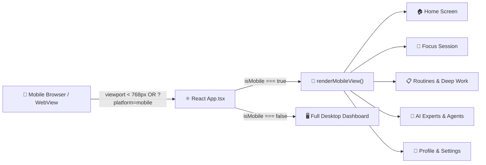
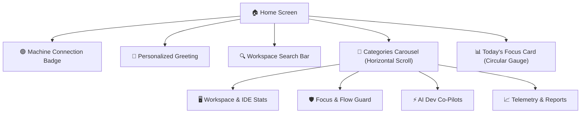
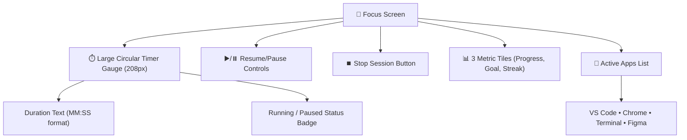
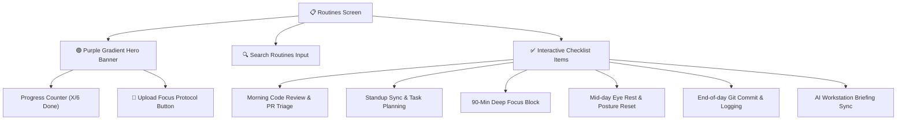
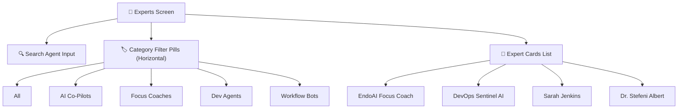
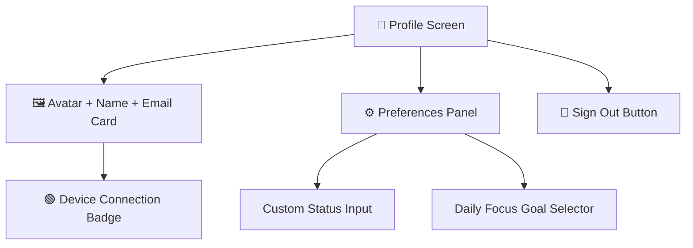
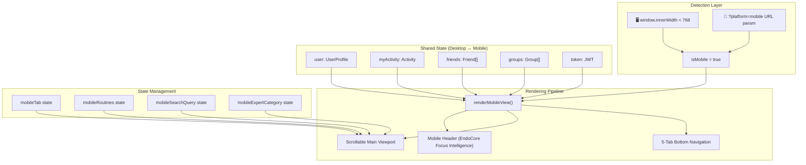
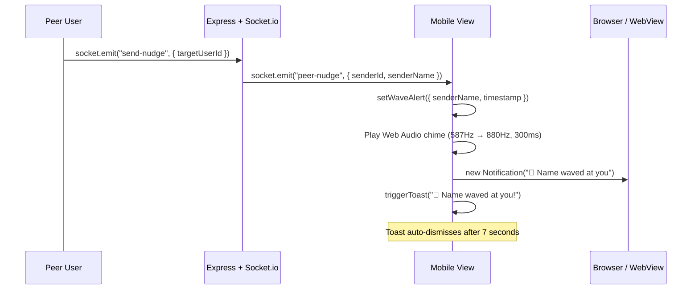
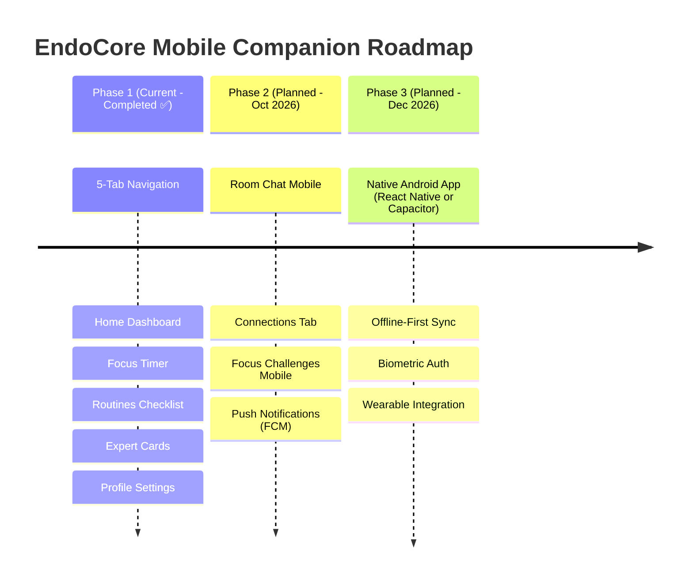

<div align="center">

# 📱 EndoCore Mobile Companion

### *Focus Intelligence • Productivity Routines • AI-Powered Developer Wellness*

[](https://react.dev)
[](https://www.typescriptlang.org/)
[](https://socket.io/)
[](https://www.framer.com/motion/)
[](https://tailwindcss.com/)
[](https://ai.google.dev/)

**The EndoCore Mobile Companion transforms any smartphone into a real-time developer wellness dashboard, focus timer, routine tracker, and AI co-pilot — seamlessly synced with your desktop workstation.**

[📱 Screens](#-screen-by-screen-guide) • [🏗️ Architecture](#-mobile-architecture) • [🎨 Design System](#-design-system--theming) • [🔌 API Sync](#-backend-api-integration) • [🚀 Quick Start](#-running-the-mobile-view) • [🎯 Navigation](#-navigation-system)

</div>

---

## 🎯 What is EndoCore Mobile?

EndoCore Mobile is not a standalone app — it is a **responsive companion view** embedded directly within the main EndoCore React application. When the viewport width is `< 768px` or the URL query `?platform=mobile` is set, the app automatically renders a purpose-built mobile interface with a native app-like experience.



<div align="center">

### **Key Mobile Capabilities**

| Capability | Description |
|---|---|
| 🏠 **Workstation Dashboard** | Real-time device connection status, focus gauge, category navigation |
| 🎯 **Focus Timer** | Live circular timer with pause/resume controls & app telemetry |
| 📋 **Productivity Routines** | Interactive checklist with search, progress tracking, and plan upload |
| 🤖 **AI Dev Co-Pilots** | Browse & book AI agents and human focus coaches with specialty filters |
| 👤 **Profile & Settings** | Custom status, focus goal picker, theme support, and sign-out |
| 🔔 **Live Notifications** | WebSocket-driven peer waves, toast alerts, and audio chimes |
| 📡 **Real-Time Sync** | Socket.io + REST polling ensures desktop ↔ mobile state parity |

</div>

---

## 📱 Screen-by-Screen Guide

### **Screen 1: 🏠 Home — Workstation Dashboard**

The Home screen is the landing tab showing a personalized greeting, workstation connection badge, search bar, horizontal category carousel, and today's focus progress gauge.



**Key UI Elements:**

| Element | Description |
|---|---|
| **Connection Badge** | Green pulsing dot with device name (e.g., `WS-WORKSTATION-11 Connected`) |
| **Greeting** | Dynamic greeting (`Good morning/afternoon/evening`) + user first name |
| **Session Status** | Contextual subtitle: *"Session active — in deep focus flow"* or *"Session paused"* |
| **Search Bar** | Full-width rounded input with purple accent search button |
| **Categories Carousel** | 4 gradient cards: *Workspace & IDE Stats*, *Focus & Flow Guard*, *AI Dev Co-Pilots*, *Telemetry & Reports* — tapping navigates to the corresponding tab |
| **Today's Focus Card** | SVG circular gauge showing percentage of daily goal, current hours logged, and goal target |

---

### **Screen 2: 🎯 Focus Session — Live Timer & App Telemetry**

The Focus screen centers around a large circular timer gauge that reflects the actual tracked session duration from the desktop agent, along with session controls and active app monitoring.



**Key UI Elements:**

| Element | Description |
|---|---|
| **Timer Gauge** | 208×208px SVG circle with cyan stroke (`#00f2fe`) indicating elapsed time, animated with `transition-all duration-700` |
| **Duration Display** | Mono font, large text showing `MM:SS` format derived from `myActivity.durationSeconds` |
| **Status Badge** | Amber pill for "Paused", Emerald animated pill for "Running" |
| **Action Buttons** | Cyan "Resume/Pause" button + Dark square "Stop" button |
| **Metric Tiles** | 3-column grid: **Progress** (% of goal), **Goal** (target hours), **Streak** (consecutive days) |
| **Active Apps** | 4 tracked app cards (VS Code, Chrome, Terminal, Figma) with duration times and active indicator dot |

**Focus Timer API Integration:**
```
POST /api/my-activity
Body: { app, project, isPaused: true/false }
Headers: Authorization: Bearer <token>
```

---

### **Screen 3: 📋 Routines & Deep Work — Interactive Checklist**

The Routines screen features a purple gradient hero banner, progress counter, searchable checklist, and plan upload functionality.



**Default Productivity Routines:**

| # | Routine | Detail | Default |
|---|---|---|---|
| 1 | Morning Code Review & PR Triage | VS Code & GitHub • Post Coffee • 08:00 AM | ✅ Done |
| 2 | Standup Sync & Task Planning | Jira & Slack • 08:30 AM | ✅ Done |
| 3 | 90-Min Deep Focus Block | VS Code • Code Implementation • 09:30 AM | ⬜ Pending |
| 4 | Mid-day Eye Rest & Posture Reset | Pomodoro Pause • 01:00 PM | ⬜ Pending |
| 5 | End-of-day Git Commit & Logging | Terminal & Dashboard • 05:30 PM | ⬜ Pending |
| 6 | AI Workstation Briefing Sync | Gemini AI • 06:00 PM | ⬜ Pending |

**Interactivity:**
- Tapping a routine item toggles its `done` state and triggers a toast notification
- Search field live-filters the list by routine title
- "Upload Focus Protocol" button supports PDF/PNG document uploads
- Progress badge shows `X/6 Done (XX%)` in real-time

---

### **Screen 4: 🤖 AI Dev Agents & Focus Coaches**

The Experts screen is a marketplace-style browsable directory of AI agents and human specialists, with search, category filters, and session booking.



**Available Specialists:**

| Agent | Title | Specialty | Rating | Pricing |
|---|---|---|---|---|
| **EndoAI Focus Coach** | Flow State & Performance Mentor | Deep Work & Context-Switch Optimization | ★ 4.9 | Free / Included |
| **DevOps Sentinel AI** | GitOps & CI/CD Diagnostic Daemon | Automated PR Reviews & Build Telemetry | ★ 4.95 | Free / Included |
| **Sarah Jenkins** | Developer Burnout & Energy Coach | Mental Stamina & Posture Balance | ★ 5.0 | $95 / hour |
| **Dr. Stefeni Albert** | Performance & Ergonomics Specialist | Cognitive Load & Focus Protocols | ★ 4.8 | $80 / hour |

**Features:**
- 🔍 Full-text search across name, title, and specialty
- 🏷️ Scrollable category filter pills: *All, AI Co-Pilots, Focus Coaches, Dev Agents, Workflow Bots*
- 📇 Premium cards with avatar, rating, experience badge, and "Book Session" CTA
- ✓ Verified specialist badges

---

### **Screen 5: 👤 Profile & Settings — Identity Management**

The Profile screen displays the user's avatar, name, email, device connection status, and configurable workspace preferences.



**Settings Available:**

| Setting | Type | Options |
|---|---|---|
| **Custom Status** | Text input | Free-text (e.g., *"Building the mobile companion"*) |
| **Daily Focus Goal** | Dropdown | 4h, 6h (default), 8h, 10h |
| **Sign Out** | Button | Clears JWT token & redirects to auth |

**Profile Data Sources:**
- Avatar URL from `user.avatarUrl` (Unsplash default)
- Device name from `user.deviceConnected` or fallback `WS-WORKSTATION-11`
- Settings saved on blur via `PATCH /api/user/profile` endpoint

---

## 🎯 Navigation System

### **5-Tab Bottom Navigation Bar**

The mobile app uses a sticky glassmorphic bottom navigation bar (`backdrop-blur-xl`) with 5 tabs:

```
┌─────────────────────────────────────────────────────┐
│  🏠 Home  │  🎯 Focus  │  💊 Routines  │  🩺 Experts  │  👤 Profile  │
└─────────────────────────────────────────────────────┘
```

| Tab | Icon | State Key | Description |
|---|---|---|---|
| Home | `Home` | `"home"` | Workstation dashboard & categories |
| Focus | `Target` | `"focus"` | Live timer, session controls, app tracking |
| Routines | `Pill` | `"routines"` | Daily habits & deep work checklist |
| Experts | `Stethoscope` | `"experts"` | AI agents & coach marketplace |
| Profile | `User` | `"profile"` | Identity, preferences, sign out |

**Active Tab Indicator:** Cyan dot (`bg-cyan-400`) beneath active tab icon.

**Legacy Tab Mapping:** The navigation gracefully handles legacy tab names:
```typescript
const currentTab = mobileTab === "control" ? "home"
                 : mobileTab === "room" ? "focus"
                 : mobileTab === "me" ? "profile"
                 : mobileTab;
```

---

## 🏗️ Mobile Architecture

### **Detection & Rendering Pipeline**



### **Component Architecture**

The mobile view is a **single render function** (`renderMobileView()`) within `App.tsx` that conditionally renders screen content based on the `currentTab` state:

```
App.tsx
├── State: isMobile, mobileTab, mobileRoutines, mobileSearchQuery, mobileExpertCategory
├── Shared State: user, myActivity, friends, analytics, groups, token
├── renderMobileView()
│   ├── <AnimatePresence> Toast Alert
│   ├── <header> EndoCore Mobile Header
│   │   ├── Brand (EndoCore / FOCUS INTELLIGENCE)
│   │   ├── Notification Bell
│   │   └── Avatar Thumbnail → Profile Tab
│   ├── <main> Scrollable Content
│   │   ├── currentTab === "home"     → Home Screen
│   │   ├── currentTab === "focus"    → Focus Session
│   │   ├── currentTab === "routines" → Routines & Deep Work
│   │   ├── currentTab === "experts"  → AI Experts & Coaches
│   │   └── currentTab === "profile"  → Profile & Settings
│   └── <nav> Fixed Bottom Tab Bar (5 tabs)
└── Desktop View (isMobile === false)
```

---

## 🔌 Backend API Integration

The mobile view shares the same backend API and WebSocket infrastructure as the desktop dashboard. All API calls go through the `apiFetch()` wrapper that automatically injects JWT authorization headers and handles 401/403 session expiration.

### **REST APIs Used by Mobile**

| Screen | Endpoint | Method | Purpose |
|---|---|---|---|
| All | `/api/user` | GET | Fetch user profile (name, email, avatar, device, goal) |
| All | `/api/my-activity` | GET | Fetch current activity (app, duration, isPaused) |
| Focus | `/api/my-activity` | POST | Update active app, pause/resume session |
| Home | `/api/friends?group=...` | GET | Fetch room occupants for active group |
| Home | `/api/groups` | GET | Fetch all available workspace rooms |
| Profile | `/api/user/profile` | PATCH | Update custom status, focus goal, privacy settings |
| All | `/api/health` | GET | Check API, DB, AI health status |

### **WebSocket Events (Mobile)**

| Event | Direction | Handler |
|---|---|---|
| `activity-update` | Server → Client | Updates friend activity cards in real-time |
| `peer-nudge` | Server → Client | Triggers toast alert + audio chime + OS notification |
| `connection:wave` | Server → Client | Handles wave notification with sender info |
| `room-chat-message` | Server → Client | Appends new chat message to room chat |
| `connection:received` | Server → Client | Toast alert for incoming friend request |
| `connection:accepted` | Server → Client | Toast alert for accepted connection |
| `challenge:received` | Server → Client | Toast alert for focus challenge invitation |
| `challenge:started` | Server → Client | Sets active challenge state |

### **Wave Notification Pipeline (Mobile)**



---

## 🎨 Design System & Theming

### **Color Palette**

| Token | Value | Usage |
|---|---|---|
| `bg-[#09090b]` | Near-black | Page background (dark mode) |
| `bg-[#121215]` | Dark charcoal | Card backgrounds |
| `bg-[#181820]` | Slate dark | Metric tile backgrounds |
| `bg-[#1a1a22]` | Deep gray | Form input backgrounds |
| `bg-[#25233b]` | Purple-tinted dark | Icon containers, accent panels |
| `#00d2a0` / `#00f2fe` | Teal / Cyan | Progress gauge strokes, active indicators |
| `#4facfe` → `#00f2fe` | Blue gradient | Category card (Focus & Flow Guard) |
| `#00c9a7` → `#1de9b6` | Teal gradient | Category card (Workspace & IDE Stats) |
| `#ff758c` → `#ff7eb3` | Rose gradient | Category card (AI Dev Co-Pilots) |
| `#a18cd1` → `#fbc2eb` | Purple-pink gradient | Category card (Telemetry & Reports) |
| `#764ba2` → `#667eea` | Deep purple gradient | Routines hero banner |

### **Typography**

| Element | Font | Size | Weight |
|---|---|---|---|
| Header Brand | `font-sans` | `text-lg` (18px) | Bold |
| Sub-brand | `font-mono` | `8px` | Semibold, `tracking-[0.22em]` uppercase |
| Screen Titles | `font-sans` | `text-2xl` – `text-3xl` | Bold |
| Section Headers | `font-mono` | `10px` | Semibold, `tracking-[0.2em]` uppercase |
| Body Text | `font-sans` | `text-xs` (12px) | Regular |
| Metric Values | `font-sans` / `font-mono` | `text-xl` – `text-3xl` | Bold |

### **Component Radius System**

| Component | Border Radius |
|---|---|
| Cards | `rounded-3xl` (24px) |
| Buttons (primary) | `rounded-2xl` (16px) |
| Input fields | `rounded-2xl` (16px) |
| Pills / Badges | `rounded-full` |
| Icon containers | `rounded-xl` (12px) or `rounded-2xl` |
| Bottom nav bar | None (full-width) |

### **Theme Support**

The mobile view supports **Dark** and **Light** themes stored in `localStorage` under key `endocore_theme`:

```typescript
const [themeMode, setThemeMode] = useState<"dark" | "light">(() => {
  return (localStorage.getItem("endocore_theme") as "dark" | "light") || "dark";
});
```

| Theme | Background | Header | Cards |
|---|---|---|---|
| Dark (default) | `bg-[#09090b]` | `bg-[#09090b]/90` | `bg-[#121215]` |
| Light | `bg-[#fbfbfa]` | `bg-[#fbfbfa]/90` | White-toned cards |

---

## 🔔 Notification System

The mobile view supports **3 layers** of notification delivery:

### **Layer 1: In-App Toast**
```
┌──────────────────────────────────────┐
│ 🟢 👋 Sarah Chen waved at you!       │
└──────────────────────────────────────┘
```
- Glassmorphic pill positioned at `fixed top-4 left-1/2`
- Framer Motion entry/exit animations (`opacity`, `scale`, `y`)
- Auto-dismiss after 4 seconds

### **Layer 2: Web Audio Chime**
- Sine wave oscillator: 587.33Hz → 880Hz exponential ramp
- Duration: 300ms, Volume: 0.15 → 0.01 fade
- Triggered via `AudioContext` API

### **Layer 3: OS Native Notification**
- **Electron Desktop**: `endocoreDesktop.showNotification()` → Windows/Mac native toast
- **Browser**: `new Notification()` Web API with permission request fallback
- Click handler: focuses window and navigates to Connections tab

---

## 🚀 Running the Mobile View

### **Option 1: Browser Responsive Mode**
```bash
# Start the dev server
npm run dev

# Open browser and resize to < 768px width
# OR use Chrome DevTools → Toggle Device Toolbar (Ctrl+Shift+M)
```

### **Option 2: URL Query Parameter**
```bash
# Force mobile view regardless of viewport
http://localhost:3000?platform=mobile

# Force mobile view on deployed instance
https://endocore-workspace.vercel.app?platform=mobile
```

### **Option 3: Android WebView**
The mobile view can be embedded in a native Android WebView shell pointing to the server URL with `?platform=mobile` appended:

```kotlin
webView.loadUrl("https://your-server.com?platform=mobile")
```

---

## 📂 Mobile Code Reference

All mobile companion code lives within the main application source:

```
src/
├── App.tsx                    # Contains renderMobileView() function (Lines ~2020-2790)
│   ├── Mobile State Variables
│   │   ├── isMobile           # Boolean: viewport < 768px OR ?platform=mobile
│   │   ├── mobileTab          # "home" | "focus" | "routines" | "experts" | "profile"
│   │   ├── mobileRoutines     # Array of { id, title, detail, done, icon }
│   │   ├── mobileSearchQuery  # Search input state
│   │   └── mobileExpertCategory  # "All" | "AI Co-Pilots" | "Focus Coaches" | etc.
│   │
│   ├── renderMobileView()     # Main mobile render function
│   │   ├── Toast Component    # AnimatePresence toast notification
│   │   ├── Header             # EndoCore brand + bell + avatar
│   │   ├── Tab: Home          # Greeting, categories, focus gauge
│   │   ├── Tab: Focus         # Timer, controls, active apps
│   │   ├── Tab: Routines      # Hero banner, checklist, upload
│   │   ├── Tab: Experts       # Search, filters, expert cards
│   │   ├── Tab: Profile       # Avatar, settings, sign out
│   │   └── Bottom Nav         # 5-tab glassmorphic navigation
│   │
│   └── Shared Functions       # apiFetch(), triggerToast(), updateMyActiveTracker(), etc.
│
├── types.ts                   # TypeScript interfaces (UserProfile, Activity, Friend, etc.)
└── index.css                  # Global styles & design tokens
```

---

## 📊 Mobile vs Desktop Feature Comparison

| Feature | Desktop | Mobile |
|---|---|---|
| **Activity Dashboard** | Full sidebar + multi-panel layout | Single-screen card-based |
| **Focus Timer** | Panel widget with timeline | Full-screen circular gauge |
| **Room Chat** | Embedded in room detail view | Not yet available |
| **AI Briefings** | Full Gemini output panel | Via Experts tab (agent cards) |
| **Peer Waves** | Toast + timeline indicator | Toast + audio chime + OS notification |
| **Analytics Charts** | Full bar/line charts | Summary gauge (% of goal) |
| **Routines** | Not available on desktop | ✅ Mobile exclusive |
| **Expert Booking** | Not available on desktop | ✅ Mobile exclusive |
| **Room Management** | Full room wizard + owner dashboard | Not yet available |
| **Connections** | Full lobby + discover + requests | Not yet available |
| **Focus Challenges** | Full challenge system | Not yet available |
| **Theme Switching** | Per-device localStorage | Per-device localStorage |

---

## 🗺️ Mobile Roadmap



---

## 📜 License

Part of the [EndoCore Workspace](./README.md) project. Open-source under the **MIT License**.

Built by **Tawfeeq Bahur**.

---

<div align="center">

### 📱 Access the mobile companion anytime at `?platform=mobile`

*Your focus, your routines, your wellness — in your pocket.*

[⬆ Back to Top](#-endocore-mobile-companion) • [📖 Main README](./README.md)

</div>
