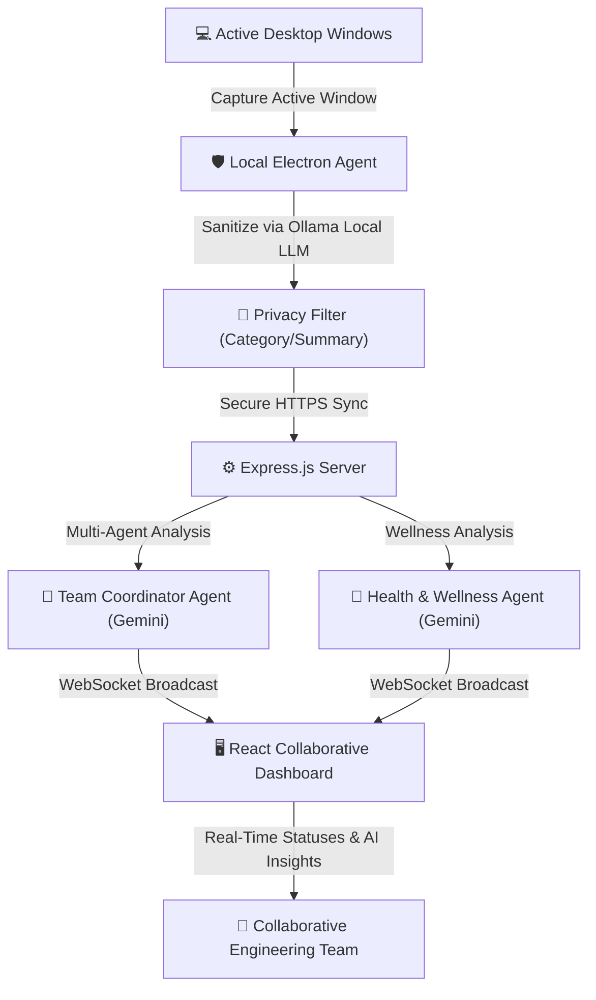
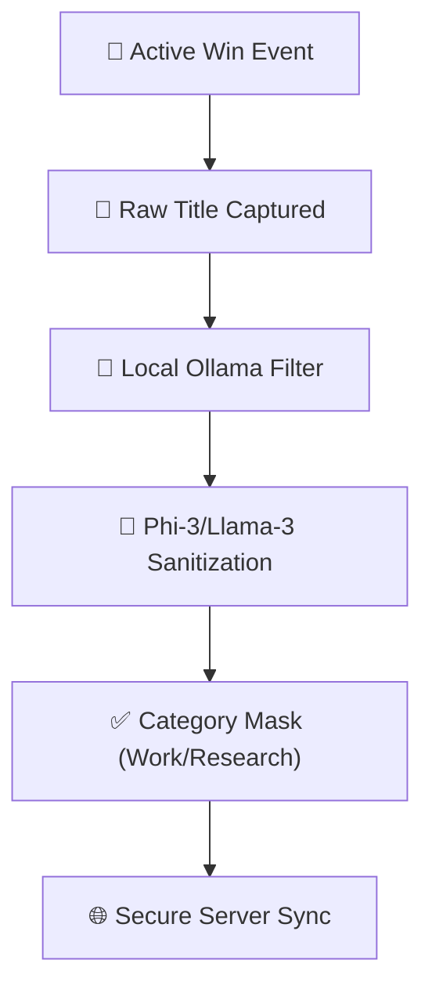
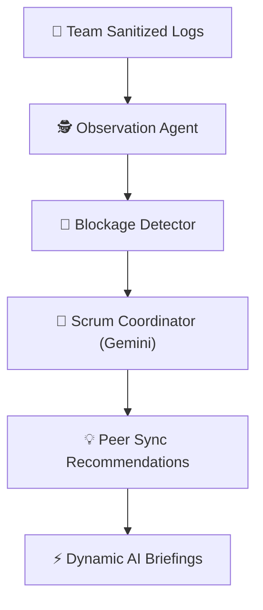
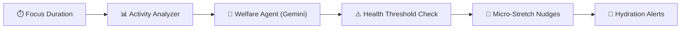
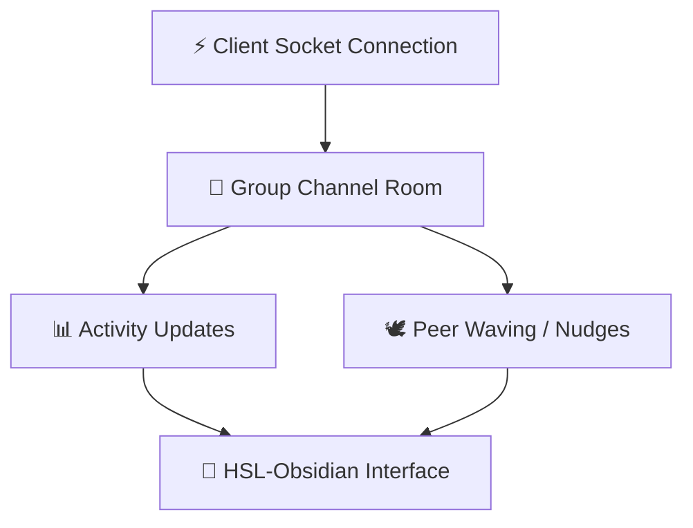
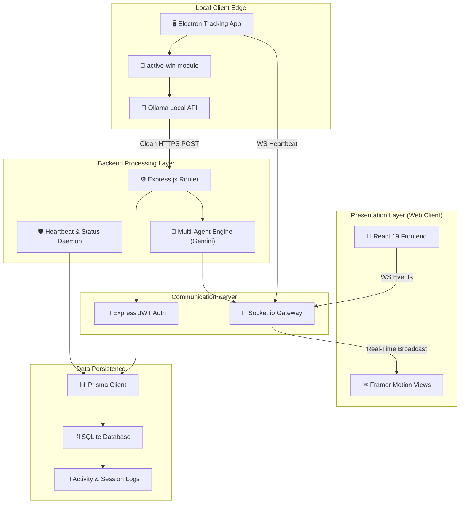
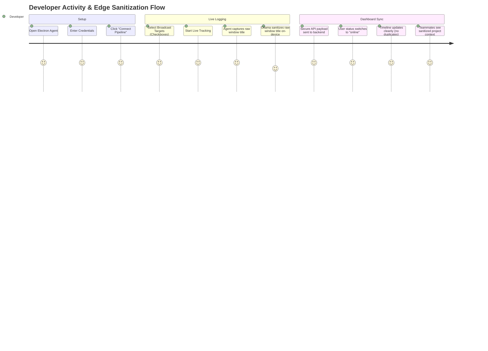
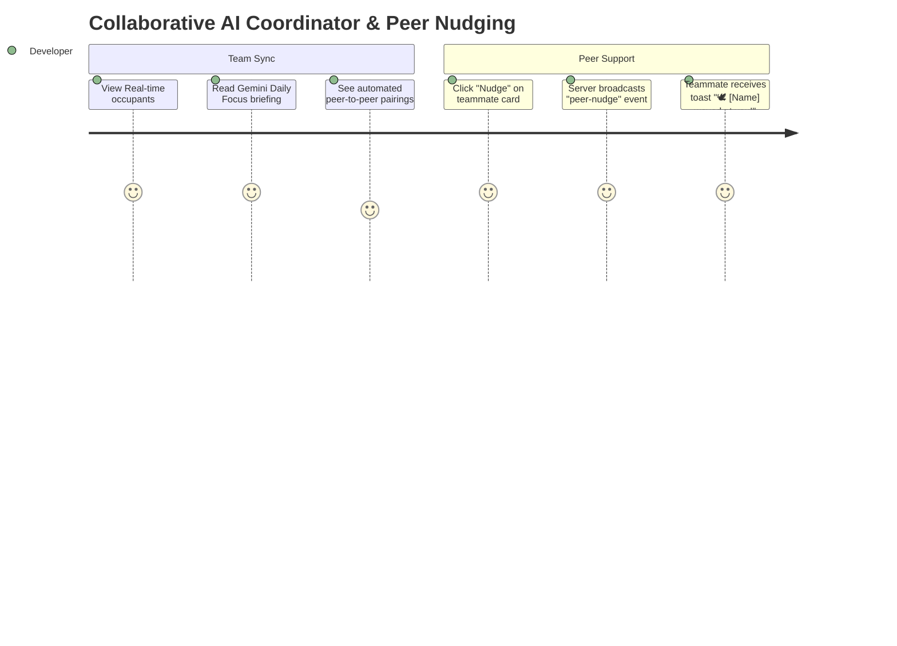
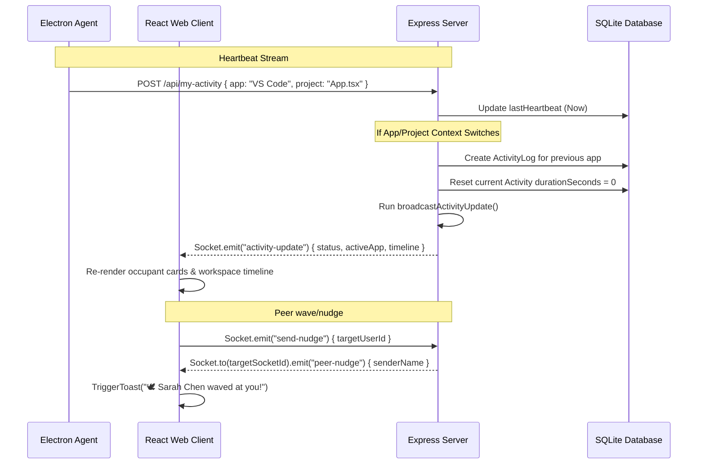
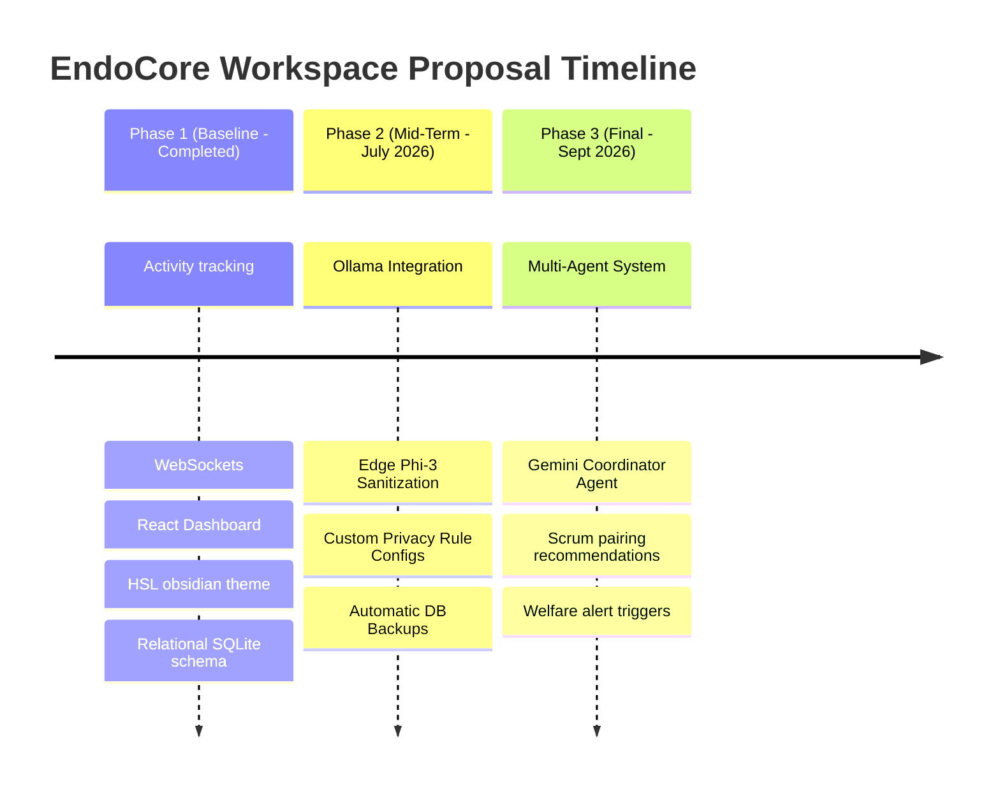

<div align="center">

# 🕊️ EndoCore Workspace

### *Privacy-Preserving Collaborative Multi-Agent Workspace & Developer Health Platform*

[](https://www.microsoft.com/en-us/windows)
[](https://react.dev)
[](https://www.electronjs.org/)
[](https://expressjs.com/)
[](https://www.prisma.io/)
[](https://www.sqlite.org/)
[](https://ai.google.dev/)
[](https://ollama.com/)

**The ultimate developer co-working platform. Tracks activity dynamically. Sanitizes data locally at the Edge. Coordinates Scrum alignments. Keeps team energy high and prevent burnout.**

[🚀 Quick Start](#-quick-start-setup) • [✨ Features](#-core-features) • [🏗️ Architecture](#-system-architecture) • [🔌 API Reference](#-api-reference) • [🤖 Agent Roles](#-multi-agent-coordination) • [🎯 Demo](#-user-experience-showcase)

</div>

---

## 🎯 What is EndoCore Workspace?



<div align="center">

### **Academic Problem** → **Intelligent Solution**
Sharing raw window titles violates developer privacy | **Local Edge Sanitization** processes data on-device before sync.
Team members work in silos, duplicating debug efforts | **Multi-Agent Scrum Coordinator** detects blocks and pairs peers.
High cognitive load and extended focus cause burnout | **Wellness Agent** tracks active focus limits and nudges breaks.
Simulated dummy data does not represent real teamwork | **Real-time Active Window tracking** streams actual telemetry.
No centralized visibility of distributed team statuses | **WebSocket-driven Workspace Dashboard** with instant status sync.

</div>

---

## ✨ Core Features

<table>
<tr>
<td width="50%">

### 🛡️ **Privacy-Preserving Edge Summarizer**


**On-Device Privacy Sanitization:**
- 🔐 Converts raw sensitive names (e.g., `personal_bank_statement.pdf`) to high-level context (e.g., `Researching Finance`).
- 🛑 Configurable levels (Full Detail, Category Only, Summary Only, Private).
- 🧬 Local execution via Ollama (Llama-3/Phi-3) with zero cloud data leaks.

</td>
<td width="50%">

### 🤖 **Multi-Agent Coordinator (Server)**


**Intelligent Collaboration Engine:**
- 🕵️ Monitors compile issues, long tasks, and active windows.
- 💡 Suggests collaborative pairings (e.g., *“Tawfeeq has been stuck on Prisma migrations for 30m; Sarah resolved this earlier, connect with her!”*).
- ⚡ Generates daily developer briefs with witticisms and developer humor.

</td>
</tr>
<tr>
<td width="50%">

### 🩺 **Welfare & Wellness Coach**


**Developer Burnout Prevention:**
- 🩺 Computes continuous work thresholds using dynamic database activity checks.
- 🧘 Suggests physical stretches, posture adjustments, or water breaks.
- 📈 Live Engagement Score history mapped and visually styled.

</td>
<td width="50%">

### 👥 **Real-Time Group Dashboard**


**High-Fidelity Co-Working Space:**
- 📡 Instant Multi-room activity broadcasting via Room WebSocket channels.
- 🕊️ Peer accountability nudges (real-time popup notifications).
- 🎨 Premium dark obsidian layouts (EndoCore Dark/Obsidian Dusk styling).

</td>
</tr>
<tr>
<td colspan="2" width="100%">

### 📊 **Real-Time Developer Workspace Metrics**
**Live Status Dashboard View:**
```
┌─ Active Member: Tawfeeq Bahur (Lead Software Developer)
├─ status: 🟢 online | activeApp: Google Chrome
├─ Today Focus Time: 1.2h / 6.0h Goal (20% Completed)
├─ Active Rooms: Engineering Group | Design & UX Crew
├─ Active Project: activity-dashboard - Antigravity IDE
└─ Workspace Support: Waved [Sarah Chen] 🕊️ | Engagement Score: 20%
```

✅ Real-time telemetry • 📡 Socket.io updates • 🎯 Dynamic timeline logs • 🧬 Zero mock data

</td>
</tr>
</table>

---

## 🏗️ System Architecture

### **High-Level Data Flow**



### **Technology Stack Matrix**

<table>
<tr>
<th colspan="2" align="center">🎨 Web Frontend (React Dashboard)</th>
<th colspan="2" align="center">⚙️ Backend Server (Express.js)</th>
<th colspan="2" align="center">🖥️ Client Desktop Agent (Electron)</th>
</tr>
<tr>
<td>Framework</td><td>React 19 + TypeScript</td>
<td>Runtime</td><td>Node.js (v18+)</td>
<td>Shell</td><td>Electron 34</td>
</tr>
<tr>
<td>Build Tool</td><td>Vite 6 + Tailwind v4</td>
<td>Routing</td><td>Express.js (TypeScript)</td>
<td>Telemetry</td><td>active-win integration</td>
</tr>
<tr>
<td>State Sync</td><td>Socket.io-client</td>
<td>Database</td><td>SQLite (dev.db)</td>
<td>Local LLM</td><td>Ollama REST Client</td>
</tr>
<tr>
<td>Transitions</td><td>Motion (Framer Motion)</td>
<td>ORM</td><td>Prisma ORM</td>
<td>IPC Bridge</td><td>ContextBridge Preload</td>
</tr>
<tr>
<td>Icons</td><td>Lucide React</td>
<td>AI Models</td><td>Gemini 3.5 Flash SDK</td>
<td>Systray</td><td>Electron Tray Icon</td>
</tr>
</table>

---

## 🎯 User Experience Showcase

### **User Flow: Desktop Activity Tracking & Sanitization**



### **Scrum Coordinator & Peer Interactions**



---

## 🚀 Quick Start Setup

### ⚡ **One-Command Installation**

To install all dependencies for both the Express Server and the Electron Desktop Agent:

```bash
# Clone the repository
git clone https://github.com/tawfeeq-bahur/activity-dashboard.git
cd activity-dashboard

# Install root dependencies (Server & Web Client)
npm install

# Install Desktop Agent dependencies
cd desktop-agent
npm install
cd ..
```

### 📋 **Prerequisites**

```
✅ Node.js v18 or higher (download: nodejs.org)
✅ Git (download: git-scm.com)
✅ Windows 10/11
✅ Ollama installed locally (for Edge AI sanitization)
✅ Gemini API Key (for Server Multi-Agent briefings)
```

### 🛠️ **Environment Configuration**

Create a `.env` file in the root directory:

```env
PORT=3000
DATABASE_URL="file:./dev.db"
JWT_SECRET="super-secret-dashboard-key"
GEMINI_API_KEY="your-gemini-api-key"
```

Run database migrations to generate the SQLite database and create schemas:

```bash
npx prisma db push
npx prisma generate
```

### 🎉 **Launch Application**

Run both the Web Dashboard and the Desktop Agent in Development Mode:

```bash
# Start Web Server & Web Client
# (Runs Express on port 3000 & Vite React Client)
npm run dev

# Start Electron Agent (Open another terminal)
cd desktop-agent
npm run start
```

---

## 🔌 API Reference

### **🔐 Authentication Endpoints**

| Endpoint | Method | Body | Purpose |
|---|---|---|---|
| `/api/auth/register` | POST | `{ name, email, password }` | Registers user & joins Default Group |
| `/api/auth/login` | POST | `{ email, password }` | Authenticates user & issues JWT token |

### **📡 Activity Tracker Endpoints**

| Endpoint | Method | Headers | Body | Purpose |
|---|---|---|---|---|
| `/api/my-activity` | GET | `Authorization: Bearer <token>` | - | Fetches current activity & status |
| `/api/my-activity` | POST | `Authorization: Bearer <token>` | `{ app, project, isPaused, togglePause, resetTimer }` | Updates active app, tracks heartbeats, logs context switches |
| `/api/user/broadcast-groups` | POST | `Authorization: Bearer <token>` | `{ groups: ["Room A", "Room B"] }` | Configures active room broadcast lists |

### **👥 Group & Peer Endpoints**

| Endpoint | Method | Headers | Purpose |
|---|---|---|---|
| `/api/friends?group=...` | GET | `Authorization: Bearer <token>` | Retrieves active occupants, timelines, roles, & statuses |
| `/api/groups` | GET | `Authorization: Bearer <token>` | Retrieves all collaboration groups / study halls |
| `/api/groups/create` | POST | `Authorization: Bearer <token>` | Creates a new cooperative workspace room |

### **🤖 GenAI & Analytics Endpoints**

| Endpoint | Method | Query | Response |
|---|---|---|---|
| `/api/ai-insights` | GET | `?force=true/false` | Generates a Gemini Scrum Summary & coaching brief |
| `/api/analytics` | GET | - | Storage, focus scores history, and comparison metrics |

---

## 📦 Project Structure

```
activity-dashboard/
│
├── desktop-agent/                    # 🖥️ Electron Tracking App
│   ├── package.json                  # Desktop agent package settings
│   ├── main.js                       # Electron entry point (handles active-win tracking)
│   ├── preload.js                    # Preload script exposing ContextBridge APIs
│   └── index.html                    # Native HTML overlay (connects to server pipeline)
│
├── prisma/                           # 🗄️ Database Schemas & Migrations
│   └── schema.prisma                 # SQLite relational structure (User, Group, Activity, logs)
│
├── src/                              # 🎨 React 19 Frontend Dashboard
│   ├── App.tsx                       # Main Dashboard component (EndoCore Dark theme)
│   ├── types.ts                      # Common TypeScript interfaces
│   ├── index.css                     # Global stylesheets & design tokens
│   └── main.tsx                      # Vite React mounting file
│
├── dev.db                            # SQLite Workspace database file
├── db.ts                             # Prisma Client adapter instantiation
├── seed.ts                           # Seeder script populating default groups & admin users
├── server.ts                         # ⚙️ Express Backend Server & WebSockets (Socket.io)
├── package.json                      # Workspace dependencies & build scripts
├── tsconfig.json                     # Root TypeScript configurations
└── vite.config.ts                    # Vite client configurations
```

---

## 📡 Live Communication Architecture

### **WebSocket Event Flow**



---

## 📊 Performance & Optimization

- **Zero-Duplicate Timeline Logging**: The server only logs database entries upon a verified context change (switches between applications or active project files), ensuring clean data analytics.
- **Heartbeat Timeout Protection**: An Express daemon checks every 15 seconds for disconnected clients. If a developer closes their agent or shuts down, the server immediately marks them `"offline"`, pauses their active focus timer, and updates group occupants.
- **SQLite Adapter Connection Pooling**: Built on `@prisma/adapter-better-sqlite3` ensuring lightning-fast local queries, database locks prevention, and concurrent REST transactions safety.

---

## 🔐 Security & Privacy Architecture

- **Context Sanitization**: Developers can toggle Privacy Levels on-the-fly. Categories are filtered locally so that private details never escape the client edge.
- **JWT Authorization**: Every HTTP REST API and Socket.io handshake is secured using state-of-the-art JSON Web Tokens.
- **Local Database Isolation**: The developer workspace database runs entirely locally in SQLite, giving full sovereignty over activity tracking metrics.

---

## 🗺️ Academic Project Roadmap



---

## 📜 License & Attribution

This project is open-source and distributed under the **MIT License**.

Built for academic submission and developer productivity optimization by **Tawfeeq Bahur**.

---

<div align="center">

### ⭐ Star this repository if you support privacy-preserving collaborative spaces!

*Making collaborative engineering transparent, healthy, and private — one wave at a time.*

[⬆ Back to Top](#-endocore-workspace)

</div>
