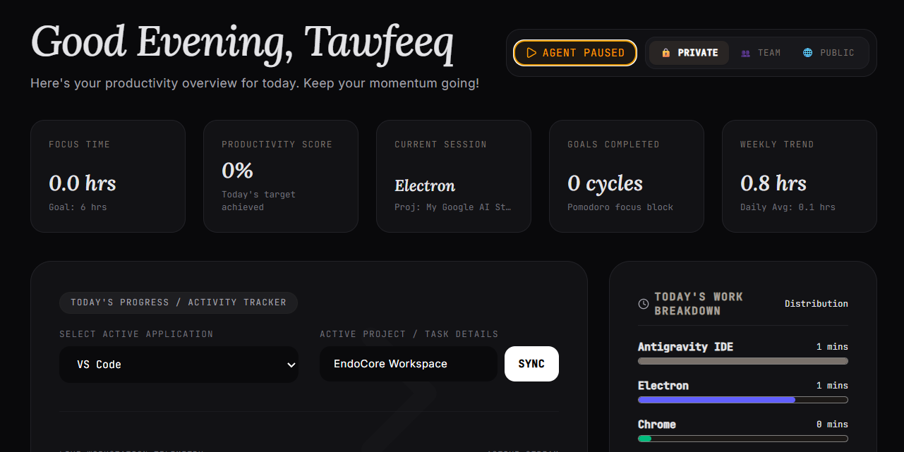

# Academic Base Papers Alignment & System Implementation Blueprint
## Project: EndoCore Workspace

This document provides the theoretical alignment between our selected base journal papers (published in 2025) and the implementation architecture of the **EndoCore Workspace** project. It serves as a permanent reference for academic reviews, proposal defenses, and thesis writing.

---

## 📚 Finalized Base Journal Papers (2025)

We have finalized two high-impact, peer-reviewed journal papers from **IEEE Xplore** and **Nature Portfolio (Scientific Reports)** as the academic foundation of this project:

### 📄 Base Paper 1 (BP7) - Edge Activity Privacy
*   **Title:** *Privacy-Preserving On-Screen Activity Recognition via One-Shot Federated Learning*
*   **Journal:** IEEE Access (2025)
*   **Authors:** Parayush Swami, Annu Priya, Balamurugan Palanisamy, Debangshu Roy, Vikas Hassija, and GSS Chalapathi (Senior Member, IEEE)
*   **Core Focus:** Recognizing on-screen active applications (e.g., Coursera, YouTube, Amazon) on edge devices in decentralized/remote workspaces, using on-device Deep Learning classifiers (CNNs) and Federated Learning (FL) to process visual data locally and preserve user privacy.

### 📄 Base Paper 2 (BP5) - Secure Productivity Optimization
*   **Title:** *Enhancing workplace productivity with secure AI using federated contrastive learning model for performance optimization*
*   **Journal:** Nature Scientific Reports (2025)
*   **Authors:** G. Maya and A. Suganya
*   **Core Focus:** SECURE and decentralized workplace productivity analysis. Using Federated Contrastive Learning (FCL) and Homomorphic Encryption to evaluate employee performance and optimization metrics across partitioned nodes without leaking private corporate or individual data.

---

## 🎯 The Research Problem & Project Goal

### **The Conflict:**
Modern collaborative software teams require real-time visibility to align tasks, prevent duplicated effort, and spot when a colleague is blocked. However, developers are hesitant to share raw window titles, browser history, or document names due to severe privacy concerns (e.g., exposing personal search queries, bank details, or private documents).

### **The EndoCore Solution (Proposed Project):**
Our system implements a **Privacy-Preserving Collaborative Platform** that uses a **Local Edge Client (Electron)** to track window telemetry, processes/sanitizes it *on-device* using a **Local Small Language Model (SLM via Ollama)** before it ever leaves the client machine, and then uses a **Server-Side Multi-Agent Coordination Engine (Gemini)** to calculate focus scores and deliver team briefings without exposing raw, private data.

---

## 🏗️ System Architecture & Mapping to Base Papers

```
           ┌──────────────────────────────────────────────────────────────┐
           │                 DEVELOPER'S PC - CLIENT EDGE                  │
           │                                                              │
           │  1. Telemetry Capture: Electron App tracks active window     │
           │     using 'active-win' library (local).                      │
           │                                                              │
           │  2. Local Edge Classifier (Based on BP7):                    │
           │     Runs a Local Small Language Model (Phi-3/Llama-3 via     │
           │     Ollama) to sanitize and categorize raw window titles     │
           │     locally (e.g., "personal_bank_invoice.pdf" -> "Finance") │
           └──────────────────────────────┬───────────────────────────────┘
                                          │
                                          │  Only Sanitized Signals Sent
                                          ▼  (HTTPS POST / WebSockets)
           ┌──────────────────────────────────────────────────────────────┐
           │                        BACKEND SERVER                        │
           │                                                              │
           │  3. Multi-Agent Coordination Engine (Based on BP5):          │
           │     Evaluates sanitized team summaries, logs focus history,  │
           │     and calculates focus scores via SQLite database.         │
           │                                                              │
           │  4. Server-Side LLM Agents (Gemini 3.5 Flash):               │
           │     - Scrum Coordinator Agent: Flags blockages and syncs.    │
           │     - Welfare Agent: Detects cognitive burnout / breaks.     │
           └──────────────────────────────┬───────────────────────────────┘
                                          │
                                          │  Real-Time Streams
                                          ▼  (Socket.io)
           ┌──────────────────────────────────────────────────────────────┐
           │                REACT COLLABORATIVE DASHBOARD                 │
           │  Visualizes room members, focus scores, team briefings, and  │
           │  allows sending wellness/focus nudges.                       │
           └──────────────────────────────────────────────────────────────┘
```

---

## 📊 Comparison Matrix: Base Papers vs. EndoCore Workspace

| Feature / Dimension | Base Paper 1 (BP7 - IEEE 2025) | Base Paper 2 (BP5 - Nature 2025) | EndoCore Workspace (Our Project) |
| :--- | :--- | :--- | :--- |
| **Primary Goal** | Classify active window/app on screens while protecting image privacy. | Analyze and optimize workplace performance securely. | Provide collaborative dashboard, detect blockages, and promote wellness securely. |
| **Data Source** | Visual screenshots of the screen. | Structured employee performance datasets. | OS-level window telemetry (App Name & Window Title) tracked via Node.js/Electron. |
| **Edge Privacy Mechanism** | **One-Shot Federated Learning** (local CNN model training on screenshots, gradients shared, images discarded). | **Federated Contrastive Learning** (FCL) combined with Homomorphic Encryption on databases. | **Local Edge NLP Sanitization** (Regular expressions + Local LLM summarizer running Phi-3/Llama-3 via Ollama) + Privacy Tiers (Public, Team, Private). |
| **AI Classifier** | Deep Convolutional Neural Networks (VGG16, VGG19, InceptionResNetV2). | Contrastive Learning and Homomorphic functions. | **Generative AI & LLMs** (Local SLM on edge for sanitization; Server-side Gemini 3.5 Flash for Multi-Agent coordination). |
| **System Output** | Classified application category. | Productivity optimization metrics. | Live React Dashboard, team focus briefs, automated scrum blocks alerts, wellness nudges. |

---

## 🛠️ Why This Implementation is 100% Feasible

You do not need to build a math-heavy Federated Learning training loop. Here is how we implement the features in code:

1.  **Local Edge Tracking:** Implemented via [desktop-agent/main.js](file:///d:/PROJECTS/activity-dashboard/desktop-agent/main.js) using the `active-win` library to grab active application details in real-time.
2.  **Privacy Scrubbing:** A combination of local rule-based filters (like `sanitizeTitle` in [server.ts](file:///d:/PROJECTS/activity-dashboard/server.ts#L134)) and local LLM requests to Ollama API `localhost:11434/api/generate` to rewrite titles into safe, generalized summaries.
3.  **Collaborative Dashboard:** Already established via Vite, React, Express, Prisma ORM, and Socket.io to stream real-time updates and messages.
4.  **Multi-Agent Coordination:** Run at the server level via Gemini 3.5 Flash. It takes the sanitized logs and executes prompt pipelines for the **Scrum Coordinator Agent** and the **Welfare Agent**.

---

## 🎙️ Mentor Presentation & Defense Guide

Use this script to handle common questions from your academic reviewers:

### **Q1: Why aren't you implementing Federated Learning exactly like the papers?**
> **Answer:** *"Federated Learning is designed for training a shared model collaboratively across decentralized edge nodes (like training keyboard predictors). Our goal is not to train a new classifier model, but to classify and summarize text in real-time. We adapt the papers' core paradigm—**local processing and edge-based privacy**—by using a **Local Small Language Model (Ollama/Phi-3)** on the developer's PC to sanitize window titles locally, ensuring that raw private data never leaves the client machine."*

### **Q2: How does your project relate to Base Paper 5 (Nature 2025) on workplace productivity?**
> **Answer:** *"Base Paper 5 establishes that workplace productivity metrics can be analyzed and optimized securely across decentralized nodes. We implement this concept using **server-side Multi-Agent AI (Gemini 3.5 Flash)**. The agents read only the sanitized edge-summaries of the team to calculate productivity scores, identify compile bottlenecks, and suggest breaks, achieving the optimization goal of the paper while ensuring complete data security."*

### **Q3: What makes this a suitable Final Year Project?**
> **Answer:** *"It integrates **Edge AI** (Local LLMs for sanitization on the client), **Agentic AI** (Multi-Agent coordination for Scrum/Welfare), and **Real-Time Distributed Systems** (WebSockets/Electron/React), resolving a real-world software engineering problem with strong academic alignment to 2025 journals."*
